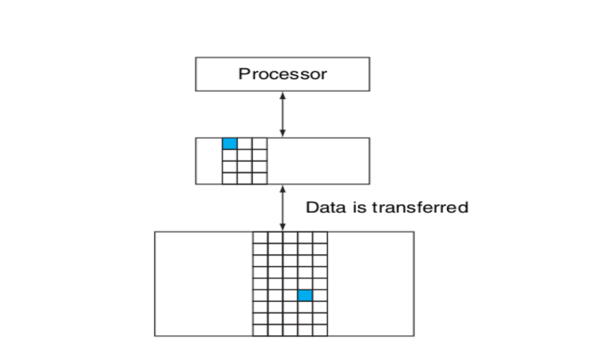

# MIPS-Architecture-Processor
* It consists of the implemention multi-cycle MIPS processor on FPGA using VHDL and pipelined simulation of the processor using Variable delays and 2-layer Cache memory in C++.
* A state machine was used to implement the control of the processor.
* BlockRAM Memory Generation has been used to store the data as well as machine code and initialize the machine code in memory using the *coe* file.
* Demonstrated on FPGA which contains the different components ALU, Register File and Memory and executes a
large subset of the MIPS instructions.
* Observe the efficiency of the processor on different HIT and MISS probabilities and delays after each memory access.
* n-way set associative cache is used that contains LOW and HIGH priority groups of dynamic group size.

Major Points of the Projects : 
* [MIPS Processor VHDL](#mips-processor-vhdl-)
* [MIPS Processor Simulation](#mips-processor-simulation-c17-)
	* [Single Piped Simulation](#single-piped-simulation-)
	* [Pipelined MIPS Simulation](#pipelined-mips-simulation)
	* [Variable Delays Analysis](#variable-delays-analysis)
* [Cache Memory Simulation](#cache-memory-simulation)

## MIPS Processor (VHDL) :
#### INPUTS :
BlockRAM Memory Generation has been used to store the data as well as machine code and initialize the machine code in memory using the *coe* file.

#### OUTPUTS :
1. Program prints the lower 16 bits of the output register in the after a perticular instruction on the 7-segment display.
2. Along with the result, it also prints the number of cycles taken to execute the program on the 7-segment display.
A switch is used to display one result at a time. i.e. the 7-segment LED displays the register contents when the switch is 0, and the cycle count otherwise.

### Instructins Implemented : 
**R-type:** add, sub, sll, srl, jr  
**I-type:** lw, sw, bne, beq, blez, bgtz  
**j-type:** j, jal  


### Instruction Format :
#### R-type Instruction Format (R-Format)
Register format : Used for arithmetic instructions  

|  Op  |  rs  |  rt  |  rd  |  shamt  |  func  |
|------|------|------|------|---------|--------|
 
 Op : 6-bits  
 rs : 5-bits  
 rt : 5-bits  
 rd : 5-bits  
 shamt : 5-bits  
 func : 6-bits  
  
**Op:** Basic operation of the instruction, traditionally called the opcode. Opcode : The field that denotes the operation and format of an instruction.  
**rs:** The first register source operand.  
**rt:** The second register source operand.  
**rd:** The register destination operand. It gets the result of the operation.  
**func:** Function. This field. often called the function code, selects the specific variant of the operation in the opfield.  

* add, sub, sll, srl, jr instructions use R-format.
* rs field is unused in shift instructions.

##### constraints :
1. add  
	opcode : 000000  
	shamt : 00000  
	func : 100000  
2. sub  
	opcode : 000000  
	shamt : 00000  
	func : 100010  
3. sll  
	opcode : 000000  
	rs : 00000  
	func : 000000  
4. srl  
	opcode : 000000  
	rs : 00000  
	func : 000010  
5. jr  
	opcode : 000000  
	rt : 00000  
	rd : 00000  
	shamt : 00000  
	func : 001000  


#### I-type Instruction Format (I-Format)
Immediate format : Used by the immediate and data transfer instructions.  

|  Op  |  rs  |  rt  |  constant or address  |
|------|------|------|-----------------------|
 
 Op : 6-bits  
 rs : 5-bits  
 rd : 5-bits  
 address : 16-bits  
  
**Op:** Basic operation of the instruction, traditionally called the opcode. Opcode : The field that denotes the operation and format of an instruction.  
**rs:** The first register source operand.  
**rt:** The second register source operand.  
**rd:** The register destination operand. It gets the result of the operation.  
**func:** Function. This field. often called the function code, selects the specific variant of the operation in the opfield.  

##### constraints :
1. lw  
	opcode : 100011  
2. sw  
	opcode : 101011  
3. bne  
	opcode : 000101
4. beq  
	opcode : 000100
5. blez  
	opcode : 000110  
	rt : 00000
6. bgtz  
	opcode : 000111  
	rt : 000000	


#### J-type :
Jump Instructions:

|  Op  |    target offset    |
|------|---------------------|

1. Opcode : 6-bits  
	000010 for *j*  
	000011 for *jal*  
2. target offset : 36-bits  
	target instruction index (effective target address).

##### constraints :
1. j  
	opcode : 000010  
2. jal  
	opcode : 000011  


### Conclusion :
1. Simulated the VHDL model for correctness after providing test input programs.
2. Synthesized the design. the generated bit file is downloaded into the FPGA and run the processor on the board.
3. Implementation of non-leaf procedures (procudures that can call other procedures) using stack.
4. Stack implementation in memory that grows downwords


## MIPS Processor Simulation (C++17) :

### Single Piped Simulation :
1. The input of the program is a MIPS program.
2. Simulation starts with the Program Counter (PC) pointing to the first instruction.
3. Execution of the instruction, display the values of the the register File and Memory Contents as a result of executing the instruction.
4. Proceed to the next instruction and continue the execution.
5. Simulation stops when there is no further instruction to execute.

#### input:
2 files, one with MIPS instructions and 2nd with delay values of each instructions :
file 1 : 
```
add $t1 $t1 $t2
sub $t3 $t1 $s1
store:
lw $t4 12($s2)
```
file 2 : 
```
add 4
sub 4
beq 5
...etc.
```

#### output:
* Register and Non zero Memory values after each cycle.
* Total number of clock cycle counts.
* Average instruction per cycle (IPC).


### Pipelined MIPS Simulation

* This is the extension of the single piped Simulation by introducing PIPELINING into the processor.
* Hazard detection and optimization of the hazards by forwarding and bypassing.

There are total 5 stages of a pipelined processor:
1. **IF(Instruction fatch) :** This is the first stage of executing an instruction. In this, stage, the processor reads the respective instruction from I-Memory and increase the program counter to 1. After fatching the instrucion, it procced the data to the next stage in next cycle.

2. **ID(Instruction Decode) :** the second stage of pipelined processor. It decodes the data, we get from IF stage.  It indetifies the type of the instruction, the registers, destination register, offset(if any), and branch target or label(for beq, bne, blez, bgtz).

3. **EX(Instruction Execution) :** this stage is also called ALU stage because the main work of this stage is to compute. In case of R-type instrucions, it computes the final calculated result that is supposed to be stored in the destination register. We read the values of registers and calculate thier resultant in this stage.

4. **MEM(Memory Data Excess/ Read Memory) :** the memory excess port of the D-memory gets activated in this stage. This stage is active in LW and SW instructions only.

5. **WB(Write Back) :** The final stage of pipe is write back, it executes the ALU-Result or the value that is supposed to write in a register. We simply upadate the register with the new updated value.

The traditional multiple-clock-cycle pipelined diagram of five instrucions is shown below : 


The single-clock-cycle diagram corresponding to clock cycle 5 of the above pipeline is shown below:


#### The Hazards detection (not optimized):

1. if we find an instruction in EX stage such that data hazard occurs, (i.e. destination register of EX is same as one of input registers of ID stage) then we simply put two stalls “STALL_datahaz_1st” and “STALL_datahaz_2nd”.

2. if in the EX stage of the current cycle, BEQ, BNE, BGTZ, BLEZ and the program counter changes then we insert two stalls of “BranchHazard”.

4. In case of J, JR, JAL, we simply put a stall “JumpStall”.

#### Optmization of the Hazards:
We can remove the data hazards by *forwarding* and *bypasing* the values. Data hazards occur when we need the value of a register in a stage but it has not updated yet. 

**Here is the pipelined dependences in a five-instruction sequence using simplified datapaths to show the dependences:** All the dependent actions are shown in color, and “CC 1” at the top of the fi gure means clock cycle 1. Th e fi rst instruction writes into $2, and all the following instructions read $2. Th is register is written in clock cycle 5, so the proper value is unavailable before clock cycle 5. (A read of a register during a clock cycle returns the value written at the end of the fi rst half of the cycle, when such a write occurs.) The colored lines from the top datapath to the lower ones show the dependences. Th ose that must go backward in time are pipeline data hazards.


To prevent stalls because of such dependences, we use forward bypassing.
The dependences between the pipeline registers move forward in time, so it is possible to supply the inputs to the ALU need by the ‘AND’ instruction and ‘OR’ instruction by forwarding the results found in the pipeline registers in the above example. Th e values in the pipeline registers show that the desired value is available before it is written into the register fi le. We assume that the register fi le forwards values that are read and written during the same clock cycle, so the add does not stall, but the values come from the register fi le instead of a pipeline register. Register file forwarding” —that is, the read gets the value of the write in that clock cycle—is why clock cycle 5 shows register $2 having the value 10 at the beginning and −20 at the end of the clock cycle. As in the rest of this section, we handle all forwarding except for the value to be stored by a store instruction.

*Forwarding* is shown in the diagram below :


### Variable Delays Analysis
We overcame data hazards till now. There are variable delays while excessing memory. A floating point computation may depend on the data operands. So a memory access may exhibit variable delays due to the cache heirarchy. 

Here is the basic structure of memory heirarchy. Every pair of levels in the memory hierarchy can be though of as having an upper and lower level. With each level, the unit of information that is present or not is called *a block* or *a line*. Usually we transfer an entire block when we copy something between levels.



These variable delays slow down the processor by consuming extra cycles in excessing memory. If the desired data is available in cache memory, we consider this a **HIT**.  If not, then we need to excess the main D-memory as we consider this situation as **MISS**. 
  
Excess of main memory is much slower than cache. The probability of a HIT increases with the total number of blocks in cache memory. But size of cache memory decreases the speed of excessing cache memory also.
  
Sometimes, operations such as floating point arithmetic or memory accesses in a pipelined processor require variable delays. A floating point computation may depend on the data operands. A memory access may exhibit variable delays due to the cache hierarchy.
  
Assume the following points for a memory access operation :  
1. The operation completes in one cycle with probability x (this is considered a HIT).
2. The operation requires N cycles with a probability 1-x (this is considered a MISS).
3. Upon a memory request, at end of one cycle, the memory indicates whether the operation was a HIT or MISS. If HIT, the operation is complete. If not, the operation completes N-1 cycles later.

#### Input:
* Instruction file
* values of N & x

#### Output:
* Pipeline program outpus
* plot of total cycles used vs HIT Probability(x)
* plot of total cycles used vs N


#### Conclusion:
* Total number of executed cycles decreases as the probability of a HIT increases.
* the number of executed cycles linearly increases with N as we fixed the probability of a HIT, so the number of instructions that are MISS is constant. And extra cycles will be (N-1)\*(total MISS instructions).

```
make clean  
make  
make run  
make run2  
```


## Cache Memory Simulation
Development of a simulation software for cache memory. The simulated cache will have the functionality that the cache is devided in Cache Sets,
and each cache set is devided in two groups :
1. One group contains the HIGH PRIORITY lines of the set.
2. The other group contains the LOW PRIORITY lines of the set.

### Priority Rule for a Block
1. If a block/line is accessed first time, it will take place in LOW priority group.
2. If a line/block is accessed again after the initial access that fatches in into the cache, it is promoted to the HIGH PRIORITY group.
3. If a line is not accessed for sufficiently long (T cache accesses) after being moved to the HIGH PRIORITY group, it is moved to the LOW PRIORITY group.

### Locality Concept
The principle of locality states that programs access a relatively small portion of their address space at any instant of time. There are two different types of locality:
1. **Temporal locality (locality in time):**  The principle stating that if a data location is referenced then it will tend to be referenced again soon. For example, most programs contain loops, so instructions and data are likely to be accessed repeatedly, showing high amounts of temporal locality.
2. **Spatial locality (locality in space):** The locality principle stating that if a data location is referenced, data locations with nearby addresses will tend to be referenced soon. Since instructions are normally accessed sequentially, programs also show high spatial locality. For example, sequential accesses to elements of an array or a record will naturally have high degrees of spatial locality.

A direct-mapped cache with eight entries showing the addresses of memory words between 0 and 31 that map to the same cache locations, is shown below.

//image direct mapped cache

### Assumptions for this model:
1. The main memory is byte addressable.
2. A block is a single entity which can be accessed.
3. Reading and writing a block happens at block granularity. Cache is accessed at block size granularity.
4. The given data should be of block size. It means data cannot be greater than total bytes in a block.
5. When a block is accessed first time, it belogs to the LOW priority group, but when it is accessed again, it is promoted to the HIGH priority group.
6. If a HIGH Proiority block is not accessed for T cache accesses, after being moved to the HIGH priority group, it is moved to the LOW priority group.
7. The number of blocks in LOW and HIGH priority groups in a set is dynamic. i.e. HIGH and LOW priority groups are not fixed in size. The number of blocks in HIGH and LOW priority groups depends on the cache configuration. Although Total number of blocks in a set remains constant.
8. *Least Recently Used (LRU) policy* within groups is followed.
9. *Write Back* procedure is followed to make changes in main memory.

### Replacement Policy
Least Recently Used (LRU) policy within groups has been used to replace the least recently used block with newly accessed block.
When a block is accessed that is not present in cache, we go for main memory and write that block in cache. If there is a invalid block present in cache, we replace that invalid block with this newly arrived data and set this new block in LOW priority. 
If there is no invalid block in the perticular set, we remove the least recently used block from LOW priority group and insert the newly used block at that place.
If the size of LOW priority group is zero, than we apply LRU on HIGH priority group and erase the least recently used block from HIGH priority, and insert the newly used block in LOW priority group.

#### Note
1. A cache is **dirty** if the value of a block in cache and main memory are different or it is dirty if it is modified in cache but not in Main memory.
2. A cache is **valid** if it cantains valid tag and data.

### Memory Update
**Write Back** policy has been used in memory update. It means we update a perticular cache block to main memory when some other block replaces the block from cache.
If we access a block for the first time, we get a MISS, we simply copy that block from Main memory and store it in the cache. Initially it is not dirty. Now in the next instruction, if value of the block is changed, we change it in the cache, not in the memory as it occurs a HIT. At this time, the block is dirty because we modify the perticular block in cache not in main memory.
Now if a new block access occurs and we have to erase this block to make space for the newly arrived block. Then before removing the block, we update the data value in one layer uper memory(in our assignment, main memory). This process is called *Write Back*.

#### Advantage of Write Back
* Writes occur at the speed of the cache memory.
* Multiple writes within a block require only one write to main memory.
* As a result uses less memory bandwidth.


### Memory Access Format  
			Addr, type, Data
Here I assume that Addr can be upto 32 bits long integer. We separate these 32 bits in tag, set address and offset. tag bits determine the perticular block in a corresponding set. set address bits determine the corresponding set. and the offset bits determine the byte addresses that indicate same block.
Let’s understand this with the below given test case. 
1. Here cache size is 16 bytes and block size is 2 bytes. Then total blocks in cache  = 16/2 = 8
2. Cache associativity is 2, it means each set contains 2 blocks. Total num of sets = 8/2 = 4
3. Let the sets be set 0, set 1, set 2 and set 3.
4. number of offset bits = log2(block size) = log2(2) = 1
5. number of set address bits = log2(total num of sets) = log2(4) = 2
6. rest are tag bits.

|			tag			| set address | offset bits |
|-----------------------|-------------|-------------|

### Errors
Program will throw error if any of the below listed conditions happens :
1. Cache Size, block Size and set associativity should follow the following constraint :
           Cache Size = k * Block Size * Set Associativity
           			where k is an integer value (total number of sets in cache)
           
2. Data is given for a block. So given data should not exceed the block size.
           Maximum bits in Data = Block Size * 8
						OR
				Data < 2Block Size * 8
3. Block size and set associativity should be a power of 2 and block size should be less than 8 bytes (64 bit).
       Block size = 2^A
Set associativity = 2^B
Cache Size = k * 2^(A+B)
4. Block Size and set Associativity cannot be zero either.
5. Block Size should be less than 9 (upto 64 bytes).


### IMPLEMENTATION DETAILS :
Hashmap m has been used for main memory.  
* Check whether the inputs are valid or not, if not then return.  
* Find number of offset bits, set address bits and tag bits  
* get maximum value a block can store (to check the valid access)  
* For each access :  
    * separate address, type of access, tag and data  
    * check validity of data  
    * check whether it is a HIT  
        * update last access time and data (if it is a write).   
        * If it is a read access, then read the data from cache  
    * if it is a MISS  
        * if it is a ‘R’ access
            * read data value from memory (create valid random value and store in main memory)
        * create a block that is to be inserted
        * insert that block in LOW priority of respective set using LRU policy within groups
        * Write Back : update the erased cache block in main memory.
    * Update the LOW and HIGH priority groups of each set with total number of accesses.
    * Print the set configuration
* Print Cache Statistics.


  


## Feedback
All bugs, feature requests, pull requests, feedback etc., are welcome.

## License
### Code
MIT License : see the LICENSE file.

### Images
Computer Organization and Design, The hardware software interface, Fifth Edition by *David A. Patterson*, *John L. Hennessy*.


**Manoj Kumar  
2nd Year Dual (B.Tech + M.Tech)  
Department of Computer Science and Engineering  
Indian Institute of Technology, Delhi  
manoj.kumar.cs518@cse.iitd.ac.in**